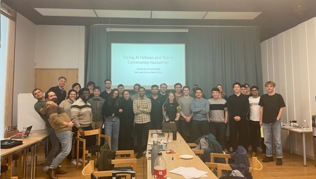

---
# Feel free to add content and custom Front Matter to this file.
# To modify the layout, see https://jekyllrb.com/docs/themes/#overriding-theme-defaults

layout: home
---

  <h1>Turing AI Fellows and Teams Community Hackathon (30th and 31st of March 2023)</h1>
  

    One of the key aspects to advance the Artificial Intelligence field is to build communities around ML and its applications. 
    As a step towards this goal, we held the first Turing AI Fellows Community Hackathon. It enabled ML and domain 
    experts to share their knowledge and start building research collaborations.
  

  

    
  

  

    Hackathon participants formed teams and selected one research problem to address during their two days at Cambridge. 
  

  
 
    Participants selected research problems from the following list:
    <ul>
      <li>
        <a target="_blank" href="./materials/problem_1/causal_discovery_cancer.html">
          Causal discovery for cancer
        </a>
	  </li>
      <li>
        <a target="_blank" href="./materials/problem_2/grid_operation.html">
          Learning to run a power network
        </a>
      </li> 
      <li>
        <a target="_blank" href="./materials/problem_3/low_cost_prediction.html">
          Low cost climate prediction
        </a>
      </li>  
    </ul>
  

  

    Each team gave a short presentation at the end of the second day to summarise their work.
  

  <h2>Organising Team</h2>
    <ul>
      <li>
         <a target="_blank" href="https://mlatcl.github.io/people/christian-cabrera.html">
          Christian Cabrera - University of Cambridge
         </a>
      </li>
      <li>
         <a target="_blank" href="https://www.c2d3.cam.ac.uk/directory/16841/mr-pingfan-song">
          Pingfan Song - University of Cambridge
         </a>
      </li>
      <li>
         <a target="_blank" href="https://faisallab.org/members/paul-festor">
          Paul Festor - Imperial College London
         </a>
      </li>
      <li>
         <a target="_blank" href="https://mlatcl.github.io/people/oluwatomasin-dada.html">
          Tomisin Dada - University of Cambridge
         </a>
      </li>
      <li>
         <a target="_blank" href="https://gfelekis.github.io/">
          Giorgos Felekis - University of Warwick
         </a>
      </li>
    </ul>
	<h2>Chairs</h2>
    <ul>
      <li>
         <a target="_blank" href="https://inverseprobability.com/">
          Neil D. Lawrence - University of Cambridge
         </a>
      </li>
    </ul>

